<div align="center">

# CampEats

**Aplikasi Pemesanan Makanan Berbasis Android untuk Lingkungan Kampus**


</div>

---

## Daftar Isi

- [Tentang Proyek](#tentang-proyek)
- [Latar Belakang](#latar-belakang)
- [Fitur Utama](#fitur-utama)
- [Teknologi yang Digunakan](#teknologi-yang-digunakan)
- [Alur Sistem](#alur-sistem)
- [Pratinjau Aplikasi](#pratinjau-aplikasi)
- [Peningkatan dari Versi Sebelumnya](#peningkatan-dari-versi-sebelumnya)
- [Pengujian](#pengujian)
- [Kesimpulan](#kesimpulan)
- [Informasi Proyek](#informasi-proyek)

---

## Tentang Proyek

**CampEats** adalah aplikasi pemesanan makanan berbasis Android yang dirancang khusus untuk memudahkan aktivitas jual-beli makanan di lingkungan kampus. Proyek ini merupakan lanjutan dari pengembangan versi sebelumnya, dengan fokus utama pada **redesign UI/UX**, penambahan **fitur manajemen pesanan**, serta penyempurnaan **dashboard admin**.

Aplikasi dibangun menggunakan **Java** dan **Android SDK**, dengan pendekatan **Material Design** untuk menghasilkan antarmuka yang bersih, modern, dan mudah digunakan oleh pengguna di lingkungan kampus.

> Papan manajemen proyek: [ClickUp Board](https://app.clickup.com/90181799294/v/s/90187327418)

---

## Latar Belakang

Pada semester sebelumnya, aplikasi CampEats versi awal telah dikembangkan dengan fitur dasar pemesanan makanan. Berdasarkan hasil evaluasi sistem, ditemukan beberapa area yang masih perlu ditingkatkan, di antaranya tampilan antarmuka, pengalaman pengguna, manajemen pesanan, serta kapasitas dashboard admin. Pengembangan lanjutan ini hadir untuk menjawab kebutuhan tersebut.

**Rumusan masalah yang menjadi fokus pengembangan:**
1. Bagaimana merancang aplikasi pemesanan makanan berbasis Android yang mudah digunakan?
2. Bagaimana menerapkan sistem poin sebagai bentuk reward bagi pengguna?

**Tujuan pengembangan:**
- Merancang dan membangun aplikasi pemesanan makanan berbasis Android.
- Meningkatkan pengalaman pengguna melalui antarmuka yang sederhana dan modern.

---

## Fitur Utama

### Sisi Pengguna (User)

| Fitur | Deskripsi |
|---|---|
| **Autentikasi** | Login dan registrasi akun pengguna |
| **Pemilihan Bahasa** | Pengaturan bahasa aplikasi saat awal penggunaan |
| **Daftar Menu** | Menampilkan daftar menu makanan menggunakan `RecyclerView` |
| **Pencarian Menu** | Mencari menu makanan secara cepat dan spesifik |
| **Keranjang Pesanan** | Mengelola item yang akan dipesan sebelum checkout |
| **Checkout & Pembayaran** | Proses checkout dengan metode pembayaran digital dan kalkulasi total harga otomatis |
| **Tracking Pesanan** | Memantau status pesanan secara real-time |
| **Riwayat Transaksi** | Melihat histori pemesanan yang telah dilakukan |
| **Sistem Poin/Reward** | Mendapatkan poin dari setiap transaksi sebagai bentuk reward |
| **Manajemen Profil** | Mengelola data profil pengguna dan logout |

### Sisi Admin

| Fitur | Deskripsi |
|---|---|
| **Dashboard Admin** | Ringkasan data dan aktivitas aplikasi secara menyeluruh |
| **CRUD Menu Makanan** | Menambah, mengubah, melihat, dan menghapus data menu makanan |
| **Manajemen Pesanan** | Mengelola dan memantau pesanan yang masuk dari pengguna |

---

## Teknologi yang Digunakan

| Komponen | Teknologi |
|---|---|
| Bahasa Pemrograman | Java |
| Platform | Android |
| UI Design | XML + Material Design |
| IDE | Android Studio |
| Tampilan Daftar Data | `RecyclerView` |
| Penyimpanan Sesi | `SharedPreferences` |
| Navigasi | `Bottom Navigation` |

---

## Alur Sistem

```
1. Pengguna melakukan login atau registrasi akun
        v
2. Pengguna mengakses halaman beranda dan melihat daftar menu
        v
3. Pengguna memilih menu dan menambahkannya ke keranjang
        v
4. Pengguna melakukan checkout dan memilih metode pembayaran
        v
5. Sistem menyimpan transaksi dan menambahkan poin reward
```

**Pendekatan perancangan antarmuka:**
- Tampilan sederhana dan modern
- Navigasi menggunakan Bottom Navigation
- Konsistensi warna dan komponen Material Design

---

## Pratinjau Aplikasi

### Mockup & Storyboard

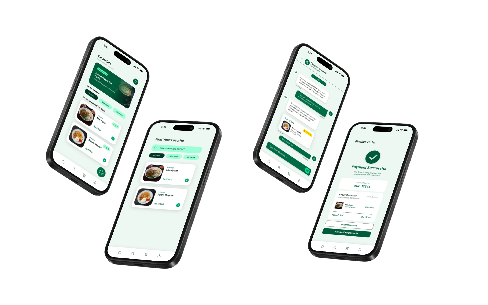
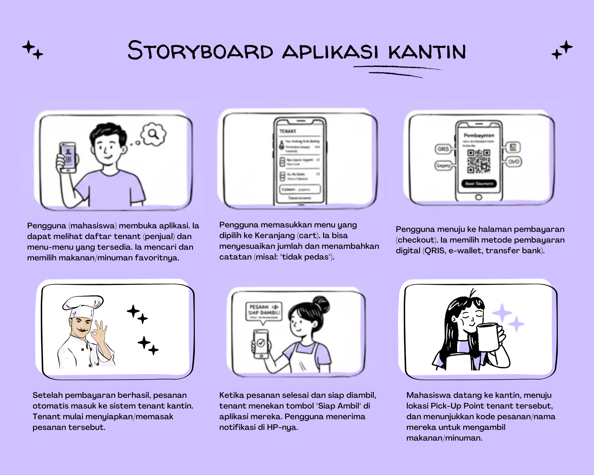

### Tampilan Aplikasi — Sisi User (Design Figma)

| Halaman | Preview | Halaman | Preview |
|--------|---------|--------|---------|
| Splash Screen | 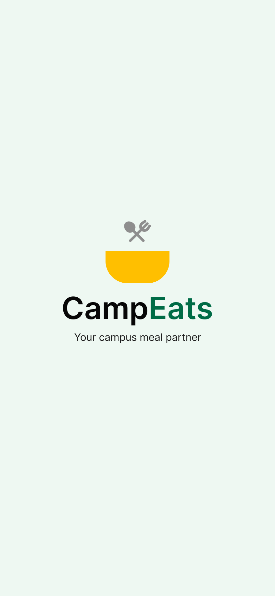 | Pilih Bahasa | 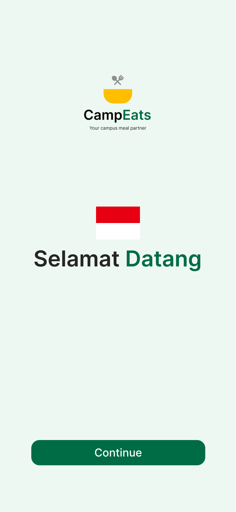 |
| Welcome | 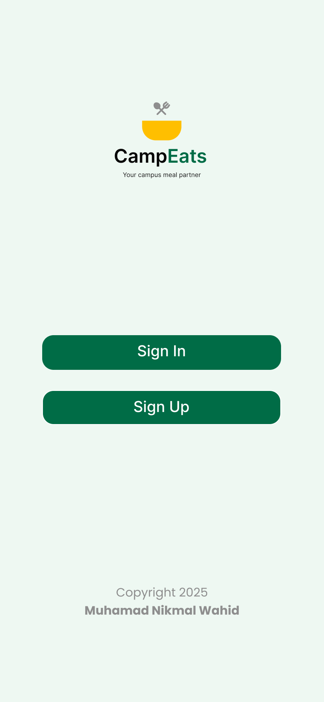 | Login | 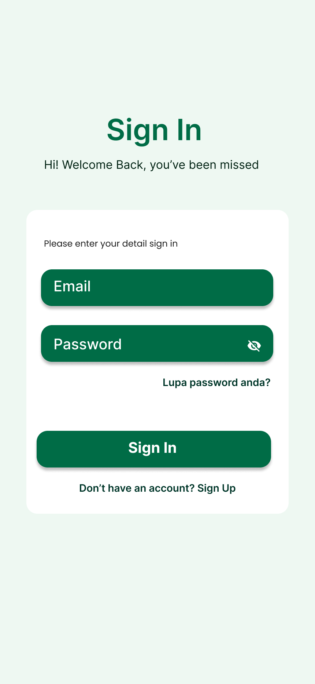 |
| Register | 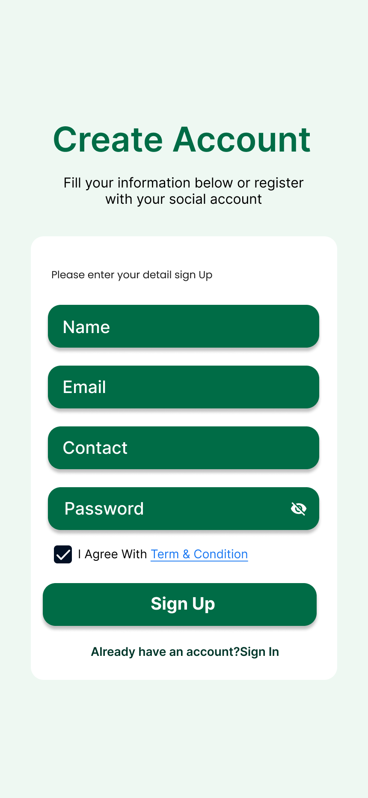 | Home | 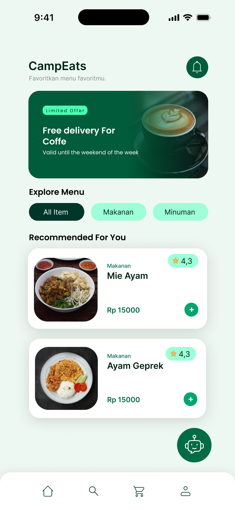 |
| Search | 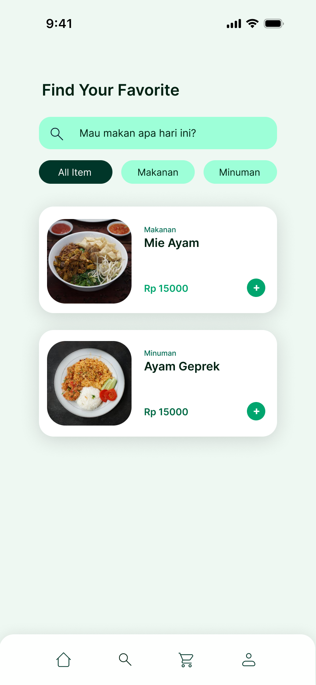 | Cart | 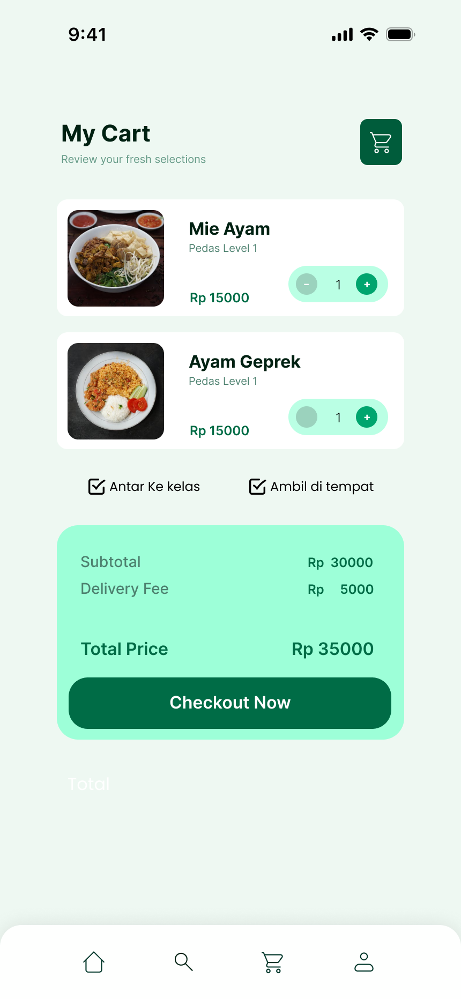 |
| Profile | 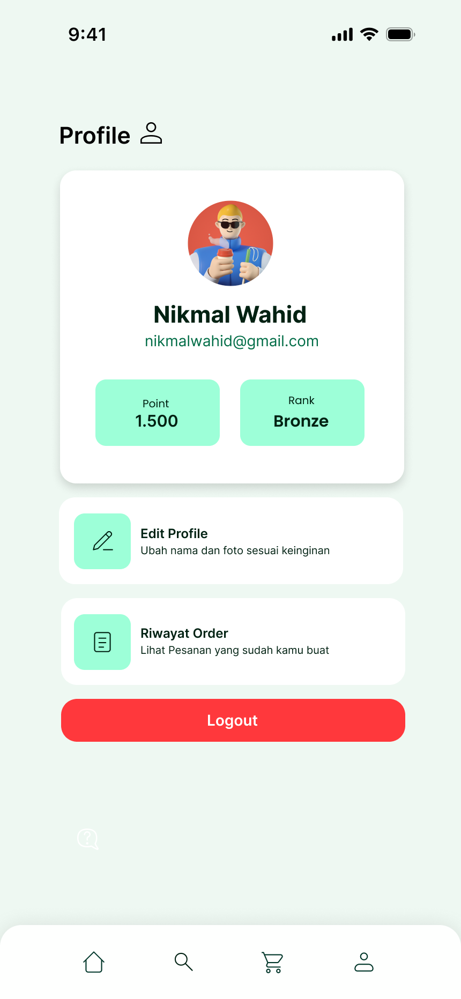 | Detail Produk | 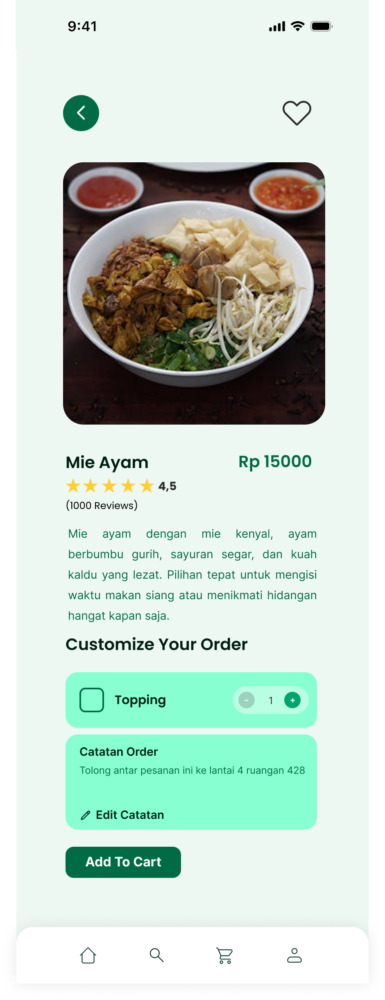 |
| Keranjang Update | 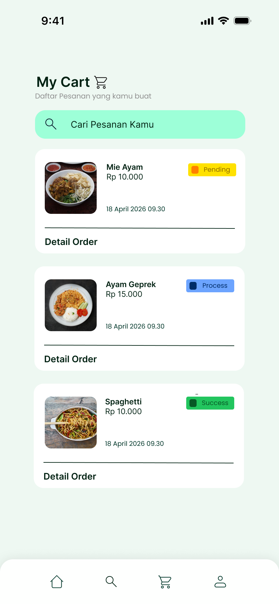 | Tracking Order | 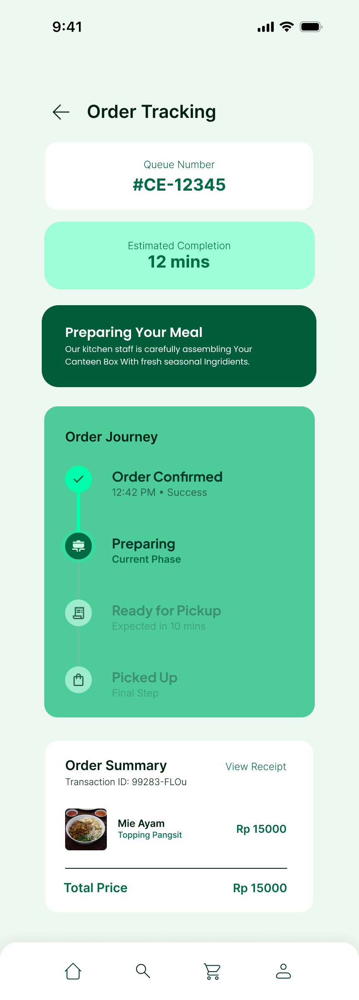 |
| Final Order | 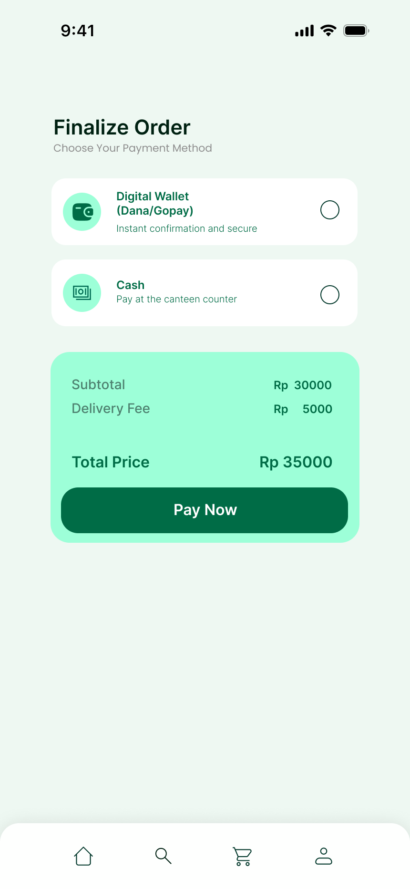 | Success Order | 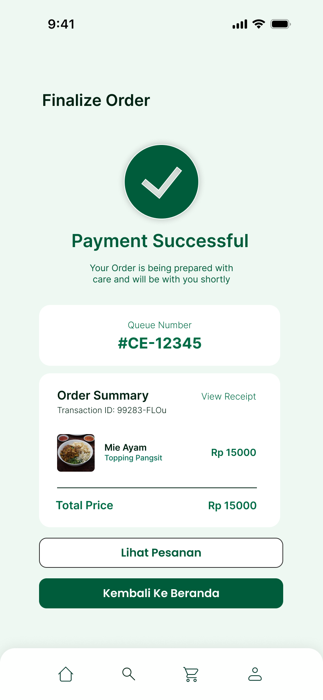 |

### Tampilan Aplikasi — Sisi Admin (Design Figma)

| Halaman | Preview | Halaman | Preview |
|--------|---------|--------|---------|
| Dashboard Admin 1 |  | Dashboard Admin 2 |  |
| Dashboard Admin 3 |  | Dashboard Admin 4 |  |
| Dashboard Admin 5 |  | | |

---

## Peningkatan dari Versi Sebelumnya

Hasil evaluasi terhadap versi sebelumnya menemukan beberapa kekurangan berikut:
- Tampilan antarmuka masih sederhana
- Belum tersedia tracking status pesanan
- Belum tersedia sistem pembayaran yang lebih terstruktur
- Dashboard admin masih terbatas
- Fitur CRUD menu belum optimal

Berdasarkan temuan tersebut, pada semester ini dilakukan pengembangan sebagai berikut:

- [x] Redesign tampilan aplikasi dengan konsep modern minimalis
- [x] Penambahan halaman tracking pesanan
- [x] Penambahan metode pembayaran digital
- [x] Pengembangan dashboard admin
- [x] Penambahan fitur CRUD menu makanan
- [x] Optimalisasi navigasi pengguna
- [x] Penyempurnaan alur checkout

---

## Pengujian

Pengujian dilakukan secara fungsional untuk memastikan setiap fitur berjalan sesuai dengan kebutuhan sistem.

**Hasil pengujian:**
- Aplikasi dapat berjalan dengan baik tanpa error utama
- Seluruh fitur utama dapat digunakan sesuai rancangan
- Penyimpanan data lokal berjalan dengan stabil

---

## Kesimpulan

Hasil pengembangan lanjutan menunjukkan bahwa aplikasi **CampEats** mengalami peningkatan signifikan dari sisi tampilan, fitur, dan pengalaman pengguna dibandingkan versi sebelumnya.

---

## Informasi Proyek

| Atribut | Detail |
|---|---|
| **Nama** | Muhamad Nikmal Wahid |
| **NIM** | 312410372 |
| **Kelas** | I241C |
| **Mata Kuliah** | Pemrograman Mobile 2 |
| **Dosen Pengampu** | Donny Maulana, S.Kom., M.M.S.I. |
| **Project Board** | [ClickUp](https://app.clickup.com/90181799294/v/s/90187327418) |
